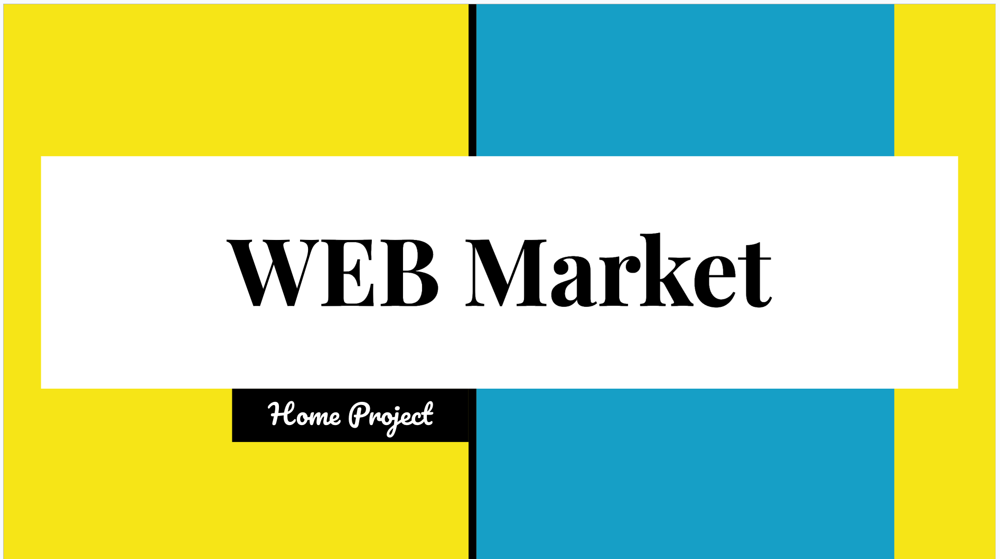

  

<h2> Назначение проекта </h2>

<h3> Web Market - Это Интернет магазин позволяющий покупателям изучить действующий ассортимент товаров и оформить заказ (Web Market состоит из клиентской и серверной части)</h3>
<body>
   <dev>
   
Сервис позволяет:

     <ul>
     <li> Аутентификацию и регистрацию пользователей;</li>
     <li> Защиту веб-приложения;</li>
     <li> Просмотр товаров;</li>
     <li> Добавление товаров в корзину;</li>
     <li> Формирование заказов;</li>
     <li> Управление корзиной;</li>
     <li> Валидация вводимых данных;</li>
     <li> Навигация;</li>
     </ul>
   </dev>
  <dev>
   
 Сервис в своей работе использует модули:

   <ul>
     <li>Web;</li>
     <li>фреймворк Spring Scurity;</li>
     <li>фреймворк SpringBoot;</li>
     <li>AngularJS;</li>  
     <li>Spring Data + MySQL;</li>  
     <li>NoSQL - Redis;</li>  
     <li>дополнительно: Flyway, Lombok</li>  
     <li>Для сборки проекта используем Apache Maven;</li>
     </ul>
  </dev>
    <dev>
   <h2>О проекте</h2>
   
<h5>Основные возможности проекта:</h5>

 
Пошаговая презентация проекта 

   

     </dev>
   

  <dev>
     <h2>Сборка приложения:</h2>

   <dev>
   
Требуется выполнить следующие шаги:

     <ul>
     <li>Сделать git clone этого проекта: <a href="https://github.com/AndreyIgnatev/Home-Project_WEB-Market.git">https://github.com/AndreyIgnatev/Home-Project_WEB-Market.git</a></li>
     <li>Собрать архив при помощи maven, используя команду в терминале: <code>mvn clean package</code></li>
    </ul>
         </dev>
  </dev>
   

     <dev>
     <h2>Технические требования:</h2>
<ul> 
<li> Java версии не ниже 8; </li> 
</ul>
</dev>